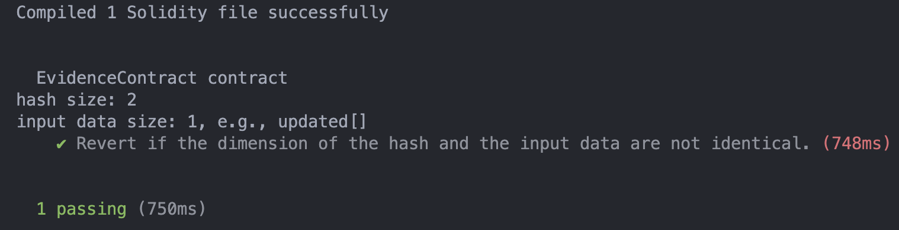

## Problematic code design that read value from array which can lead to out of bounds

**Describie the bug**

The contract *EvidencContract* contains a bug that can lead to out of bounds when copying data from input parameters. For instance, in function `createEvidenceWithExtraKey` of the contract, a for loop (lines 17 to 40) copy the value of parameters, e.g., *sigs*, from index 0 to index *i*, i.e., the length of the parameter *hash* (line 30). However, the lengths of conveyed parameters are not checked to be identical which may cause out of bounds during execution.

```solidity
function createEvidenceWithExtraKey(
        bytes32[] hash,
        address[] signer,
        string[] sigs,
        string[] logs,
        uint256[] updated,
        string[] extraKey
    ) public {
        uint256 sigSize = hash.length;
        bytes32[] memory hashs = new bytes32[](sigSize);
        string[] memory sigss = new string[](sigSize);
        string[] memory logss = new string[](sigSize);
        address[] memory signers = new address[](sigSize);
        uint256[] memory updateds = new uint256[](sigSize);
        uint256[] memory previousBlocks = new uint256[](sigSize);
        uint256 succeededCount = 0;
        for (uint256 i = 0; i < sigSize; i++) {
            bytes32 thisHash = hash[i];
            if (!isHashExist(thisHash)) {
                if (isEqualString(sigs[i], "")) {
                    // this record is a pure log event while hash does not exist, hence skipped
                    continue;
                }
                // add test to emit revertion
                console.log("hash size: %s", sigSize);
                console.log("input data size: %s, e.g., updated[]", sigs.length);
                require(sigSize <= sigs.length, "array index overflow");
                succeededCount++;
                hashs[i] = thisHash;
                sigss[i] = sigs[i];
                logss[i] = logs[i];
                signers[i] = signer[i];
                updateds[i] = updated[i];
                previousBlocks[i] = changed[thisHash];
                changed[thisHash] = block.number;
                if (!isEqualString(extraKey[i], "")) {
                    extraKeyMapping[extraKey[i]] = thisHash;
                }
            }
        }
        if (succeededCount > 0) {
            emit EvidenceAttributeChanged(
                hashs,
                signers,
                sigss,
                logss,
                updateds,
                previousBlocks
            );
        }
    }
```


**To Reproduce**

Steps to reproduce the behavior:

1. prepare harhat testing environment
2. copy problematic *EvidenceContract* with inserted statements (lines 24 to 27 shown above) which are used in test to a created directory `contracts`
3. use the followed test js to execute `npx hardhat test`

```js
const { expect } = require("chai");

describe("EvidenceContract contract", function () {
  it("Revert if the dimension of the hash and the input data are not identical.", async function () {
    const [owner] = await ethers.getSigners();

    const EvidenceContract = await ethers.getContractFactory(
      "EvidenceContract"
    );

    const test = await EvidenceContract.deploy();

    await expect(
      test.createEvidenceWithExtraKey(
        [
          "0x7465737400000000000000000000000000000000000000000000000000000000",
          "0x7465737500000000000000000000000000000000000000000000000000000000",
        ],
        [owner.address],
        ["test_sigs"],
        ["test_logs"],
        [0, 1, 2],
        ["extrakey"]
      )
    ).to.be.revertedWith("array index overflow");
  });
});
```


**Expected behavior**

The test results will show the revertion triggered by our input parameters (lines 15 to 23 shown in js file).


**Screenshots**

